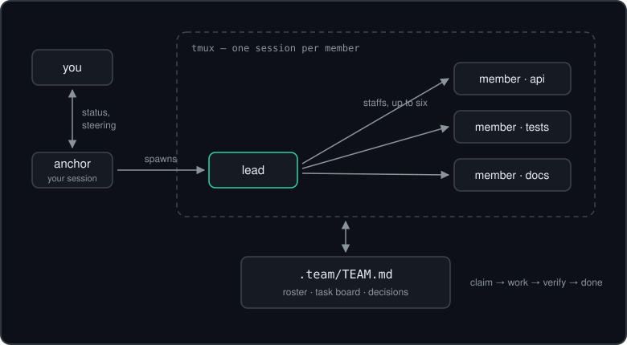
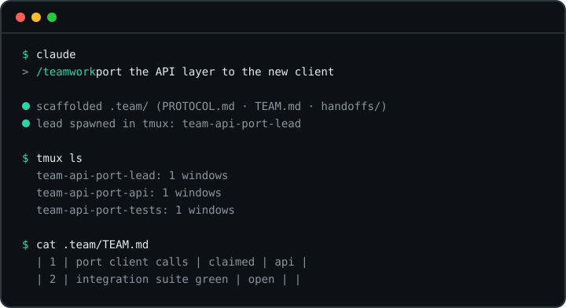

<p align="center">
  <picture>
    <source media="(prefers-color-scheme: dark)" srcset="assets/logo-dark.svg">
    
  </picture>
</p>

<p align="center">A Claude Code skill for running big jobs with a team of sessions instead of one.</p>

---

<p align="center">
  
</p>

You type `/teamwork <mission>`. Your session becomes the **anchor** — your window into the team. It sets up a shared workspace, spawns a **lead** session in tmux, and steps back. The lead breaks the mission into tasks, staffs a team of up to six sessions, and drives the work against a verification bar it sets before anything else. You keep talking to your own session the whole time: ask for status, change scope mid-flight, review the result at the end.

There's no orchestrator process and no framework underneath. Coordination is two things:

- **`.team/TEAM.md`** — the single source of truth. A roster, a task board, and a decision log, edited in place by whoever is working.
- **Claude Code's session message bus** — wakeups and questions only, never state. Nobody polls anybody.

A few rules make it hold together: members claim a task on the board before touching anything, one owner per task; "done" means checked against the mission's verification bar with the evidence noted on the board, not "looks finished"; and when a member's context runs low it writes a handoff doc and spawns its own successor, so the team outlives any single context window. The full ruleset is in [`PROTOCOL.md`](skills/teamwork/PROTOCOL.md) — it's short, and every member reads it first.

## Install

With the [skills CLI](https://skills.sh):

```sh
npx skills add 0xenesbayram/teamwork-skill       # this project
npx skills add 0xenesbayram/teamwork-skill -g    # everywhere
```

The CLI can install skill folders for other agents too, but the protocol currently assumes Claude Code — it leans on session messaging (`ListAgents`/`SendMessage`) and the `claude` CLI in its spawn pattern. Making it agent-agnostic is on the list.

As a Claude Code plugin:

```sh
claude plugin marketplace add 0xenesbayram/teamwork-skill
claude plugin install teamwork@teamwork-skill
```

Or just copy the folder:

```sh
git clone https://github.com/0xenesbayram/teamwork-skill
cp -r teamwork-skill/skills/teamwork ~/.claude/skills/
```

Copy into `.claude/skills/` inside a project instead if you only want it there.

## Use

From a Claude Code session in your project root:

```
/teamwork port the API layer to the new client and get the integration suite green
```

<p align="center">
  
</p>

Then watch it go. Useful things to know while a mission runs:

- Ask the anchor for status any time — it answers from `TEAM.md` and the handoff docs without interrupting anyone.
- Steering ("actually, skip the admin routes") goes through the anchor too. The lead re-plans the board.
- Every member is a real Claude Code session in its own tmux session. `tmux ls` shows them as `team-<slug>-<role>`, and `tmux attach -t team-<slug>-lead` drops you into any of them. Detach with `Ctrl+b d`.
- When the lead reports done, the anchor re-verifies independently before presenting the result to you. Feedback loops back through the board until you accept, and teardown kills the tmux sessions. `.team/` stays behind as the mission record.

## Permissions — read this part

By default, team members run with `--dangerously-skip-permissions`: every tool call auto-approves, so six sessions can work in parallel without stalling on prompts nobody is watching. The protocol tells members to keep the blast radius small (stay in the mission's directory, route anything destructive or outward-facing through you), but the flag means what it says. Run missions in a repo you can restore, or on a machine you don't mind an agent having.

If that trade isn't for you, edit the spawn pattern in `PROTOCOL.md` to a stricter flag before installing. The protocol already covers that mode: a member that hits a prompt it can't pass marks the task blocked and moves on, and you answer the prompt by attaching to its tmux session.

## Requirements

- Claude Code with skills and session messaging (`ListAgents` / `SendMessage`) — any recent 2.x
- tmux
- One machine, one filesystem — members coordinate through files, so this doesn't span hosts

## Why this shape

Most multi-agent setups put an orchestrator in charge and make every agent report up through it. That orchestrator becomes the bottleneck and the single context window that dies first. Here the anchor deliberately stays out of the work precisely so its context lasts the whole mission, and the state lives in a file, so any member — lead included — can be replaced mid-mission without losing the plot.

## License

MIT
